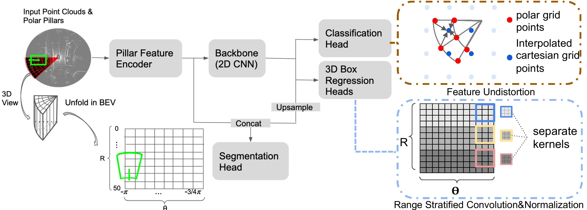
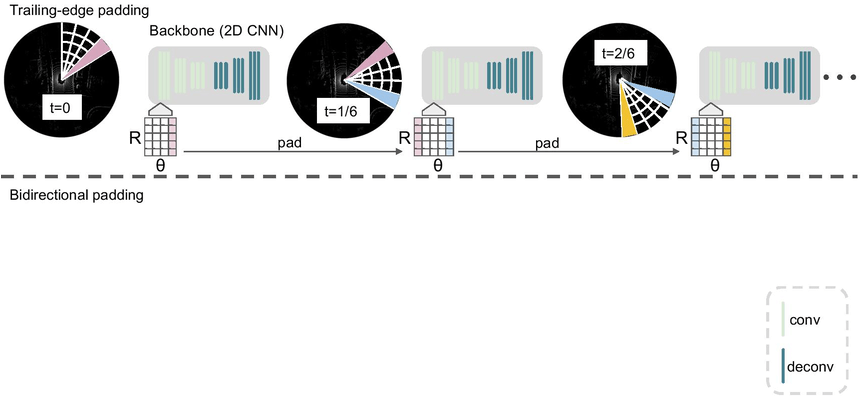

# PolarStream

Streaming Object Detection and Segmentation with Polar Pillars

  

  

> [**PolarStream**](https://arxiv.org/abs/2006.11275),            
> Qi Chen, Sourabh Vora, Oscar Beijbom,        
> *NeurIPS 2021 Poster ([arXiv 2006.11275](https://arxiv.org/abs/2006.11275))*

    @article{chen2021polarstream,
        title={PolarStream: Streaming Object Detection and Segmentation with Polar Pillars},
        author={Chen, Qi and Vora, Sourabh and Beijbom, Oscar},
        journal={Advances in Neural Information Processing Systems},
        volume={34},
        year={2021}
    }

## Contact
Any questions or suggestions are welcome! 

Qi Chen [qchen42@jhu.edu](mailto:qchen42@jhu.edu)

## Abstract
Recent works recognized lidars as an inherently streaming data source and showed that the end-to-end latency of lidar perception models can be reduced significantly by operating on wedge-shaped point cloud sectors rather then the full point cloud. However, due to use of cartesian coordinate systems these methods  represent the sectors as rectangular regions, wasting memory and compute. In this work we propose using a polar coordinate system and make two key improvements on this design. First, we increase the spatial context by using multi-scale padding from neighboring sectors: preceding sector from the current scan and/or the following sector from the past scan. Second, we improve the core polar convolutional architecture by introducing feature undistortion and range stratified convolutions. Experimental results on the nuScenes dataset show significant improvements over other streaming based methods. We also achieve comparable results to existing non-streaming methods but with lower latencies.

## Main results

#### 3D detection on NuScenes test set
|         |   MAP ↑ | NDS ↑  | PKL ↓  | FPS ↑  | 
|---------|---------|--------|--------|---------|
|PolarStream-Full Sweep | 52.9    | 61.2   |     |    26.3      |  
|PolarStream-4 CPx1 |   53.5   |   61.8  |  89.3     |    47.2   |  
|PolarStream-4 CPx2 |52.9 | 61.2| |47.2|

#### LiDAR Semantic Segmentation on NuScenes test set

|         |  mIoU | freq_weighted mIoU |  FPS  |
|---------|---------|--------|--------|
|PolarStream-Full Sweep | 73.4   | 87.4   |   33.9   |  
|PolarStream-4 CPx1 | 73 | 87.5 |59.2|
|PolarStream-4 CPx2 | 73.1 | 87.5 |59.2

#### Panoptic Segmentation on NuScenes test set 

|         |  PQ  | SQ | RQ |   FPS  |
|---------|---------|--------|--------|--------|
|PolarStream-Full Sweep | 71  | 86 | 82  |   22.3|

#### Panoptic Segmentation on NuScenes Validation Set (following [Panoptic-PolarNet](https://arxiv.org/abs/2103.14962) 's label generation & evaluation)
|         |  PQ  | SQ | RQ |   FPS  |
|---------|---------|--------|--------|--------|
|PolarStream-Full Sweep | 68.7  | 85.3 | 79.9  |   22.3|
|PolarStream-4 CPx1 |69|85.2|80.4|44.3|
|PolarStream-4 CPx2 |69.6|85.5|80.8|44.3|

All results are tested on a V100 with batch size 1.

## Highlighted Features
- [x] Polar Representation
- [x] Artificially simulating streaming lidar 
- [x] Multi-scale context padding
- [x] Simultaneous object detection and semantic segmentation
- [x] Single detection head with comparable accuracy to multi-group heads
- [x] Panoptic labels and predictions generation (compatible with nuScenes official panoptic eval)
- [x] Reimplementation of [STROBE](https://arxiv.org/abs/2011.06425)
- [x] Reimplementation of [Han et. al.](https://arxiv.org/abs/2005.01864)
- [x] Dynamic voxelization

## Use PolarStream

### Installation

Please refer to [INSTALL](docs/INSTALL.md) to set up libraries needed for distributed training.

### Common settings and notes

- The experiments are run with PyTorch 1.9, CUDA 11.2, and CUDNN 7.5.
- The training is conducted on 8 V100 GPUs 
- Testing times are measured on a V100 GPU with batch size 1. 
 
### nuScenes 3D Detection 

**We provide training / validation configurations, pretrained models in the paper**

## Benchmark Evaluation and Training 

Please refer to [GETTING_START](docs/GETTING_START.md) to prepare the data. Then follow the instruction there to reproduce our detection, semantic segmentation and panoptic segmentation results. Configurations are included in [configs](configs). 

## Model Zoo
### PolarStream with PointPillars backbone
| Model                 | det FPS          | seg FPS | panoptic FPS |Test MAP  | Test NDS  |  Test mIoU| Test freq_weigted mIoU|Validation PQ  | Validation SQ  | Validation RQ |Link          |
|-----------------------|------------------|---------|--------------|----------|-----------|-----------|-----------------------|---------------|----------------|---------------|---------------|
| [polarstream_det_n_seg_1_sector](configs/nusc/pp/polarstream/polarstream_det_n_seg_1_sector.py) | 26.3 | 33.9 |22.3|52.9 | 61.2 |  73.4| 87.4 |68.7 |85.3|79.9|[URL](https://www.nuscenes.org/data/papers/polar_stream/checkpoints/polarstream_det_n_seg_1_sector.pth) |
| [polarstream_det_n_seg_4_sector_bidirectional](configs/nusc/pp/polarstream/polarstream_det_n_seg_4_sector.py) | 47.2 | 59.2 |44.3 | 52.9 | 61.2 |  73.1 | 87.5| 69.6 | 85.5 | 80.8 |[URL](https://www.nuscenes.org/data/papers/polar_stream/checkpoints/polarstream_det_n_seg_4_sector_bidirectional.pth) |

### PolarStream with VoxelNet backbone (we only present full-sweep models here)
| Model                 | val det mAP          | Link          |
|-----------------------|----------------------|---------------|
| [voxelnet_det_cylinder_singlehead](configs/nusc/voxelnet/voxelnet_det_cylinder_singlehead.py) | 57.7  | [URL](https://www.nuscenes.org/data/papers/polar_stream/checkpoints/voxelnet_det_cylinder_singlehead.pth) |

| Model                 | val seg mIoU         | Link          |
|-----------------------|----------------------|---------------|
| [voxelnet_seg_cylinder](configs/nusc/pp/polarstream/voxelnet_seg_cylinder.py) | 77.7 |[URL](https://www.nuscenes.org/data/papers/polar_stream/checkpoints/voxelnet_seg_cylinder.pth)|

### Reimplementation of [STROBE](https://arxiv.org/abs/2011.06425) and [Han et. al.](https://arxiv.org/abs/2005.01864)
| Model                 | Link          |
|-----------------------|---------------|
| [han_1_sector](configs/nusc/pp/han_method/han_1_sector.py) | [URL](https://www.nuscenes.org/data/papers/polar_stream/checkpoints/han_1_sector.pth) |
| [han_4_sector](configs/nusc/pp/han_method/han_4_sectors.py) |[URL](https://www.nuscenes.org/data/papers/polar_stream/checkpoints/han_4_sectors.pth) |
| [strobe_1_sector](configs/nusc/pp/strobe/strobe_1_sector.py) | [URL](https://www.nuscenes.org/data/papers/polar_stream/checkpoints/strobe_1_sector.pth) |
| [strobe_4_sector](configs/nusc/pp/strobe/strobe_4_sector.py) |[URL](https://www.nuscenes.org/data/papers/polar_stream/checkpoints/strobe_4_sector.pth) |

## License

PolarStream is release under MIT license (see [LICENSE](LICENSE)). It is developed based on a forked version of [CenterPoint](https://github.com/poodarchu/Det3D/tree/56402d4761a5b73acd23080f537599b0888cce07). We also incorperate code from [PolarNet](). See the [NOTICE](docs/NOTICE) for details. Note that both nuScenes and Waymo datasets are under non-commercial licenses. 

## Acknowlegement
This project is not possible without multiple great opensourced codebases. We list some notable examples below.  

* [det3d](https://github.com/poodarchu/det3d)
* [second.pytorch](https://github.com/traveller59/second.pytorch)
* [mmcv](https://github.com/open-mmlab/mmcv)
* [mmdetection](https://github.com/open-mmlab/mmdetection)
* [OpenPCDet](https://github.com/open-mmlab/OpenPCDet)
* [polarseg](https://github.com/edwardzhou130/PolarSeg)
* [cylinder3d](https://github.com/xinge008/Cylinder3D)